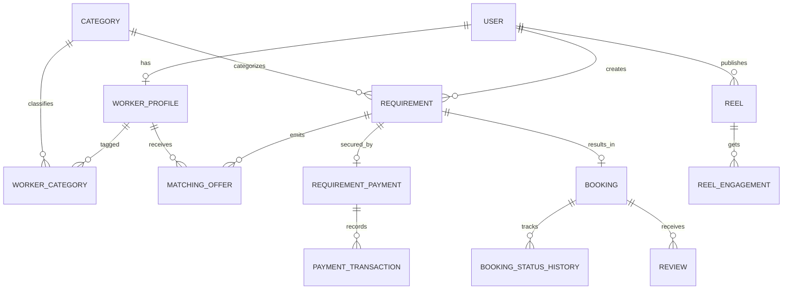

# Phase 2 — Database ERD

Relationships preserve payment and booking audit history with restrictive deletes. Matching offers are unique per requirement/worker pair. Payment references and idempotency keys are unique. Client-to-worker assignment occurs only through matching, never direct browsing. Application services must transactionally enforce payment-before-matching, state transitions, actor consistency, and rating range 1–5.