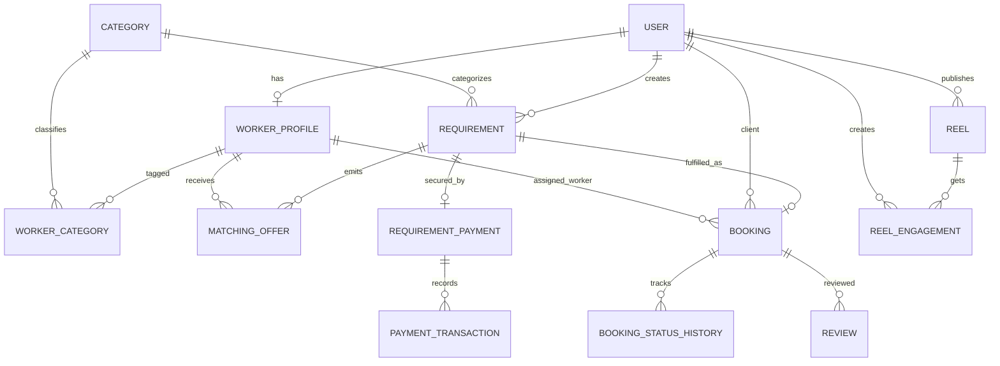

# Phase 2 — Database ERD and Relationships

## Design principles
- PostgreSQL is the system of record; Prisma models use UUID primary keys.
- Timestamps are stored as timezone-aware values.
- Monetary values use fixed-precision decimals, never floating point.
- Financial provider references and idempotency keys are unique.
- User-facing data is retained with restrictive deletes where financial or booking history must remain auditable.
- Client-to-worker selection is mediated by matching offers; no direct worker-booking discovery relationship exists.

## Relationship map

## Cardinality and delete policy
- User to worker profile: optional one-to-one; deleting a user cascades to its profile.
- Worker profile to categories: many-to-many through WorkerCategory; profile deletion cascades, category deletion is restricted while referenced.
- Client to requirements: one-to-many; client deletion is restricted to preserve requirement history.
- Requirement to matching offers: one-to-many; requirement deletion cascades offers.
- Requirement to payment: optional one-to-one; deletion is restricted once payment exists.
- Requirement to booking: optional one-to-one; requirement deletion is restricted once booked.
- Booking to status history: one-to-many; booking deletion cascades history.
- Payment to transactions: one-to-many; payment deletion is restricted while transactions exist.
- Reel/user engagements: unique per (reel, user, engagement type); deleting a reel/user cascades engagement rows.

## Constraints and indexes
- Unique email and phone when supplied; unique category name/slug.
- Unique worker/category pair, requirement/worker offer pair, requirement payment, booking per requirement, and review per booking/author.
- Unique payment provider references and idempotency keys.
- Composite indexes cover status-driven queues and user timelines.
- Prisma cannot express every cross-table business invariant. The service layer must enforce payment-secured matching, valid state transitions, rating bounds (1–5), and matching/booking actor consistency transactionally.
